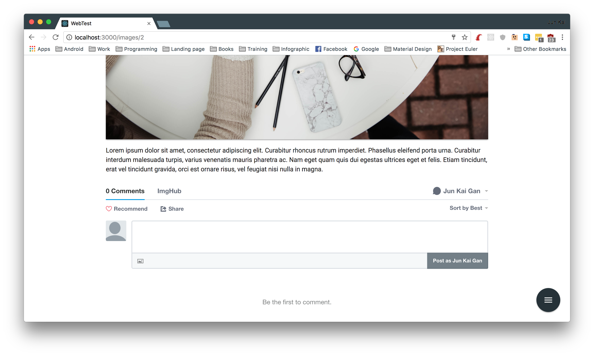

# ImgHub
A web application allows users to upload, share and comment on images.

# Installation
1. Clone the repo
2. ```bundle install``` to install all the gems
3. ```bin/yarn``` to install all the packages
4. ```rails s``` to open server



